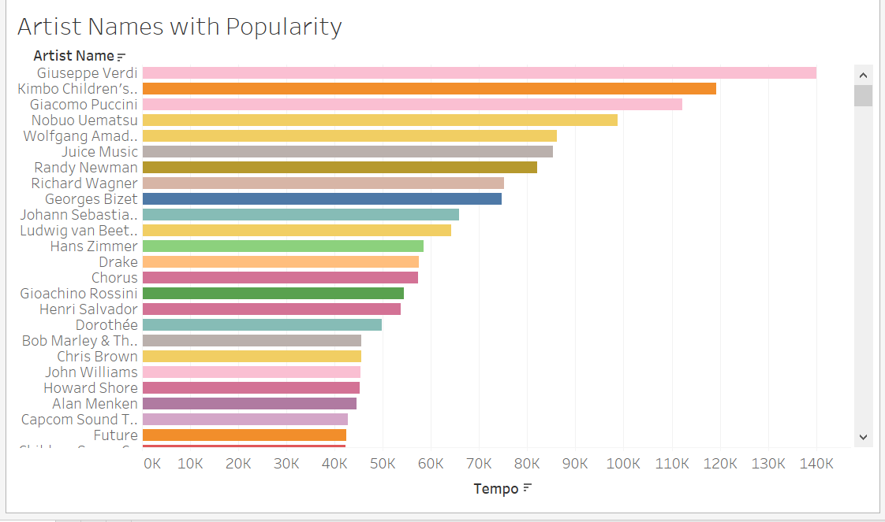

# Markdown syntax guide

## 

# Project 1 Tableau
## 
###### 

## Emphasis

**The screenshot in the tableau highlighted in plain orange that Drake has the most popularity followers totalled 31,703
_This will also be italic_

**The screenshot in the tableau highlighted in plain orange that Drake has the most popularity followers totalled 31,703**  
__The artist Giuseppe Verdi has the most tempo highlighted in light pink 140,096__

_You **can** combine them_

## Lists

### Unordered

* Item 1
* Item 2
* Item 2a
* Item 2b
    * Item 3a
    * Item 3b

### Ordered

1. Item 1
2. Item 2
3. Item 3
    1. Item 3a
    2. Item 3b

## Images


![Screenshot of Tableau]

## Links

You may be using [Markdown Live Preview](https://markdownlivepreview.com/).

## Blockquotes

> Markdown is a lightweight markup language with plain-text-formatting syntax, created in 2004 by John Gruber with Aaron Swartz.
>
>> Markdown is often used to format readme files, for writing messages in online discussion forums, and to create rich text using a plain text editor.

## Tables

| Left columns  | Right columns |
| ------------- |:-------------:|
| left foo      | right foo     |
| left bar      | right bar     |
| left baz      | right baz     |

## Blocks of code

```
let message = 'Hello world';
alert(message);
```

## Inline code

This web site is using `markedjs/marked`.


---

