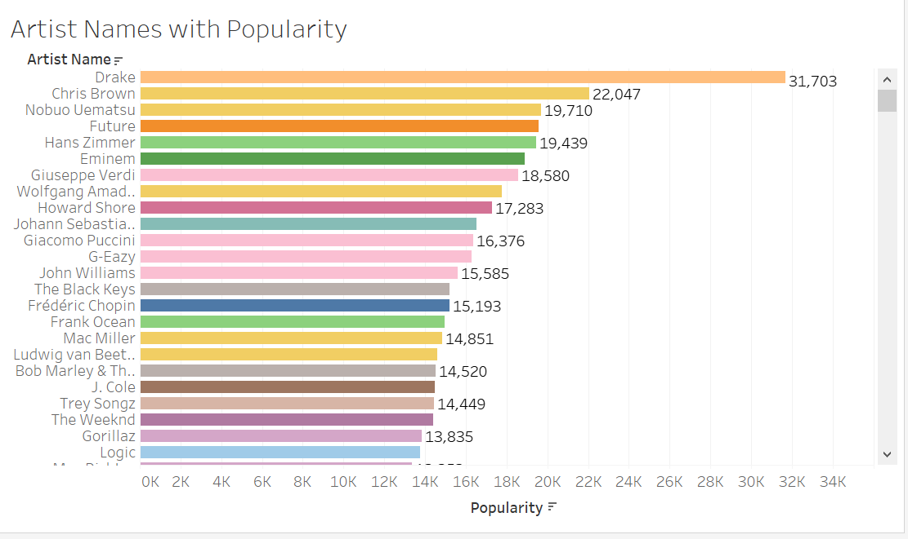
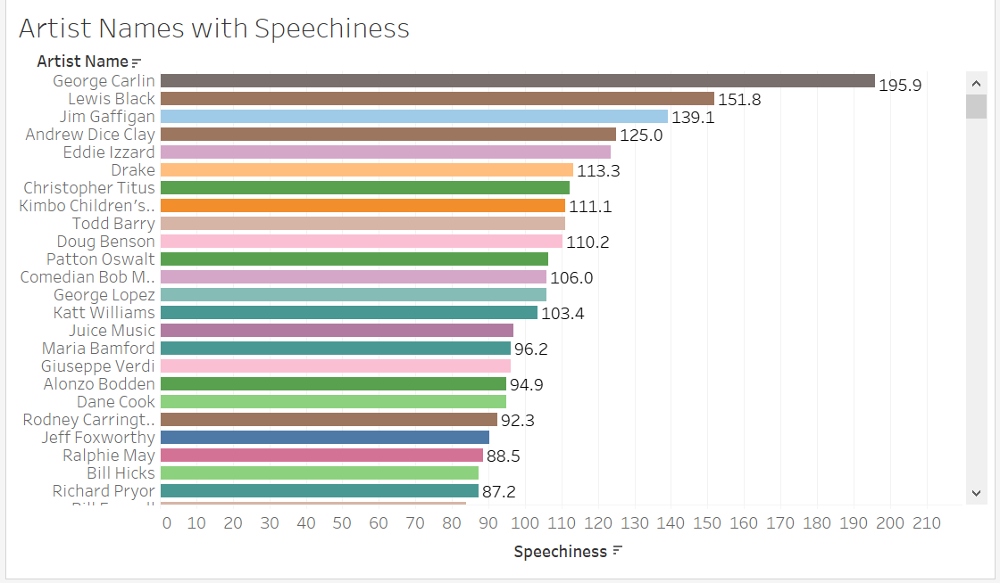

# Markdown syntax guide

# Project 1 Tableau

## Artist in Spotify

**This is how I compared the artists with different categories at tableau and see which has the most spofity followers. 

**The screenshot in the tableau highlighted in plain orange that Drake has the most popularity followers totalled 31,703**  
__The second screenshot artist Giuseppe Verdi has the most tempo highlighted in light pink 140,096__
**The third screenshot shows the artist that has the most speechiness is George Carlin totalled 195.90 

## Artists with most spotify followers
- Drake- 31,703 most popularity
- Giuseppe Verdi- 140,096 most tempo
- George Carlin- 195.90 most speechiness

## Images

## Links

[Markdown Live Preview](https://github.com/AK232-afk/github-pages/edit/main/README.md).

